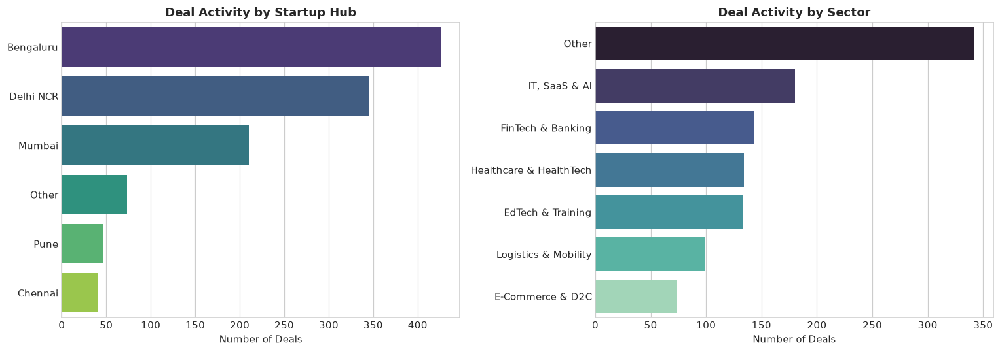

# Founder–Investor Network Analysis: Indian Startup Ecosystem

An empirical network analysis and econometric study investigating how founders, startups, and investors are connected across the Indian venture ecosystem, and whether central network positions correlate with subsequent venture funding outcomes.

---

## Project Overview

This repository contains:
- **Interactive Multi-Dimensional Network Visualizer (`founder_investor_network.html`)**: Interactive PyVis network visualizer with entity search, category-based node isolation (Founders, Startups, Investors), degree filtering, and real-time node inspection.
- **Complete Empirical Analysis Notebook (`Network-Investor analysis.ipynb`)**: End-to-end data pipeline containing:
  - Bipartite and tripartite network construction (4,002 nodes, 3,881 edges).
  - Centrality profiling (Degree, Betweenness, Eigenvector, and PageRank).
  - Syndicate community detection using the Louvain algorithm.
  - Ecosystem concentration metrics (Gini coefficient & Herfindahl-Hirschman Index - HHI).
  - Econometric OLS regressions with heteroskedasticity-robust standard errors (HC1) evaluating network centrality against subsequent funding stages.
- **Dataset (`Indian_Startup.csv`)**: Venture transaction records covering startup stages, verticals, cities, founders, and investors.
- **Documentation**:
  - `Project_Summary_Network_Analysis.docx`: Concise executive summary (<200 words) summarizing project aims, questions, methods, and core empirical findings.
  - `Methodology_and_Model_Justification.docx`: Detailed rationale explaining why specific network algorithms, centrality metrics, concentration indices, and regression specifications were selected over alternatives.

---

## Visualizations and Empirical Results

### 1. Tripartite Venture Capital Network Graph
Heterogeneous network mapping founders, startups, and institutional investors. Node sizes scale with degree centrality, and colors denote entity types (Purple: Investors, Cyan: Startups, Orange: Founders).


### 2. Centrality Correlation Matrix
Spearman and Pearson correlation profiles across Degree, Betweenness, Eigenvector, and PageRank centralities for institutional investors in the ecosystem.


### 3. Investor Market Concentration & Lorenz Curve
Empirical distribution of deal flow and capital connectivity across the investor population, illustrating high concentration (Gini coefficient = 0.548) and power-law distribution tails.


### 4. Geographic Hubs & Sectoral Deal Allocations
Comparative deal distribution across primary startup hubs (Bengaluru, Delhi-NCR, Mumbai) and key verticals (FinTech, EdTech, E-commerce).



---

## Repository Structure

```text
├── Indian_Startup.csv                     # Raw venture funding and entity dataset
├── Network-Investor analysis.ipynb        # Primary analysis and modeling notebook
├── founder_investor_network.html          # Interactive network visualization
├── Project_Summary_Network_Analysis.docx  # Executive summary document
├── Methodology_and_Model_Justification.docx # Detailed model and methodology justification
├── requirements.txt                       # Python dependencies
├── .gitignore                             # Git ignore rules for virtualenvs and temporary files
├── README.md                              # Project documentation
└── images/                                # High-resolution analytical figures and network diagrams
    ├── network_graph_visualization.png
    ├── centrality_correlation_heatmap.png
    ├── investor_concentration_lorenz.png
    └── geographic_sector_distribution.png
```

---

## Quick Start & Installation

### 1. Clone the Repository
```bash
git clone https://github.com/niy-byte/Founder-Investor-Network-Analysis.git
cd Founder-Investor-Network-Analysis
```

### 2. Set Up Virtual Environment & Dependencies
```bash
python3 -m venv .venv
source .venv/bin/activate
pip install -r requirements.txt
```

### 3. Run the Jupyter Notebook
```bash
jupyter notebook "Network-Investor analysis.ipynb"
```

### 4. View the Interactive Visualization
Open `founder_investor_network.html` in any web browser:
```bash
# On Linux
xdg-open founder_investor_network.html

# On macOS
open founder_investor_network.html
```

---

## Key Methodology & Empirical Insights
- **Tripartite Graph Representation**: Captures the heterogeneous venture flow ($F \to S \gets I$) without artificially distorting co-investment as direct investor-to-investor ties.
- **Centrality Spectrum**: PageRank and Eigenvector centrality identify prestige and recursive influence (e.g., Blume Ventures, Accel, Sequoia/Peak XV), whereas Betweenness centrality exposes crucial syndication bridges.
- **Econometric Findings**: Centrality measures exhibit a statistically significant positive relationship with funding stage progression ($R^2 = 0.437$), demonstrating strong network stratification in Indian venture capital allocation.
