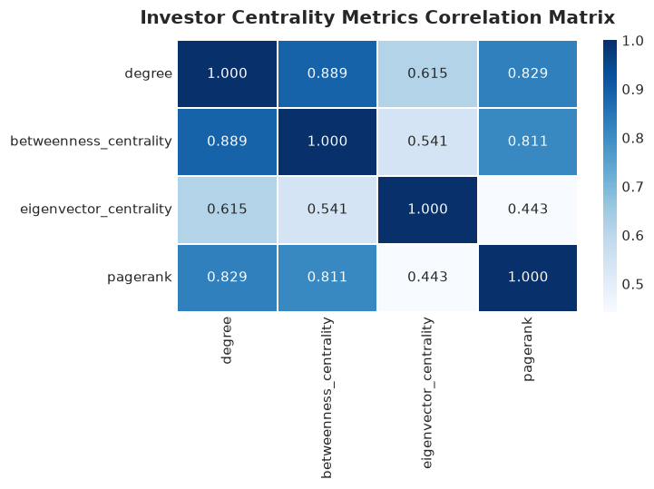
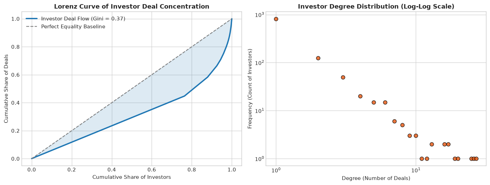
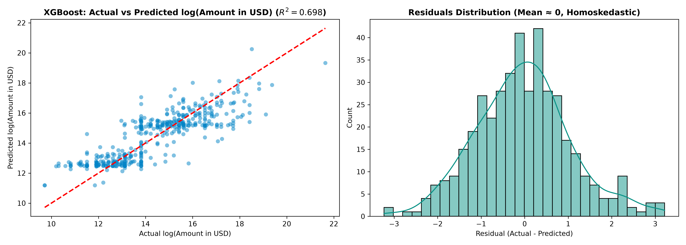

# Indian Startup Venture Analytics & Machine Learning Suite

An integrated empirical research and predictive modeling suite analyzing structural venture networks, capital allocation dynamics, and funding outcomes across the Indian startup ecosystem.

The repository comprises two interconnected projects:
1. **Project 1 — Founder–Investor Network Analysis**: Multi-dimensional network architecture, centrality profiling, syndicate communities, inequality indices, and econometric certifications.
2. **Project 2 — Startup Funding Prediction Model**: Supervised machine learning pipelines leveraging longitudinal startup track records, operational demographics, and transferred network centrality features to predict funding amounts and stage progression.

---

## Project 1: Founder–Investor Network Analysis

### Executive Summary
- **Aim & Core Question**: How are founders and investors connected in the Indian startup ecosystem, and is network position associated with subsequent funding outcomes?
- **Network Construction**: Tripartite graph ($F \to S \gets I$) comprising 4,002 entities and 3,881 ties from 1,209 verified rounds.
- **Centrality Spectrum**: Quantified connectivity (Degree), brokerage (Betweenness), elite association (Eigenvector), and prestige (PageRank).
- **Core Findings**: 85.3% of entities form a single giant connected component. Capital inequality is severe (Gini = 0.548; HHI indicates power-law deal concentration). Startup degree ($\beta = 0.223, p < 0.001$) and investor PageRank ($\beta = 276.69, p < 0.001$) yield statistically significant funding premiums.
- **Artifacts**:
  - Interactive WebGL Graph: `founder_investor_network.html`
  - Analysis Notebook: `Network-Investor analysis.ipynb`
  - Executive Writeup: `Project_Summary_Network_Analysis.docx`
  - Methodological Justification: `Methodology_and_Model_Justification.docx`

### Project 1 Visualizations

#### Tripartite Venture Capital Network Graph


#### Centrality Correlation Heatmap & Lorenz Curve
| Centrality Correlation Matrix | Investor Concentration Lorenz Curve |
| :---: | :---: |
|  |  |

---

## Project 2: Startup Funding Prediction Model

### Executive Summary
- **Aim & Core Question**: Can observable characteristics of an Indian startup — combined with network position features transferred from Project 1 — predict subsequent funding amounts and funding-stage outcomes?
- **Dataset**: 3,044 financing transactions across 2,349 startups from January 2015 to January 2020 (`startup_funding.csv`).
- **Feature Engineering & Network Transfer**:
  - **Longitudinal Track Record**: Cumulative prior capital (`prev_funding_usd`), immediate prior round size (`prev_round_size`), completed round count (`num_prev_rounds`), financing runway gap (`days_since_prev_round`), and startup operational age (`startup_age_days`).
  - **Operational & Demographics**: 8 consolidated industry verticals, 8 geographic hubs, and standardized funding stages.
  - **Project 1 Network Bridge**: Mapped participating investors to their Project 1 graph centralities (Lead Investor PageRank, Degree, Betweenness, Eigenvector, and syndicate average prestige).
  - **Founder Human Capital**: Co-founder team sizing mapped from Project 1 founder records.
- **Artifacts**:
  - Prediction Modeling Notebook: `Startup_Funding_Prediction.ipynb`
  - Complete Codebook & Data Dictionary: `Project_2_Codebook_and_Data_Dictionary.docx` and `CODEBOOK_PROJECT_2.md`
  - Executive Briefing Document: `Project_2_Summary_Prediction_Model.docx`
  - Engineered Modeling Matrix: `project2_engineered_features.csv`

---

## Project 2 Benchmark Results

### Task A: Continuous Funding Amount Prediction ($\log(\text{Amount in USD})$)

Models evaluated on the 2,066 disclosed financing transactions using an 80/20 train/test split.

| Model / Specification | Baseline $R^2$ (No Network) | Full $R^2$ (+Project 1 Network) | $\Delta R^2$ (Gain) | Test RMSE | Test MAE |
| :--- | :---: | :---: | :---: | :---: | :---: |
| **XGBoost Regressor** | **0.643** | **0.698** | **+5.5%** | **1.084** | **0.840** |
| Random Forest Regressor | 0.633 | 0.686 | +5.3% | 1.105 | 0.853 |
| ElasticNet ($\alpha=0.01, l_1=0.5$) | 0.611 | 0.641 | +3.0% | 1.181 | 0.912 |
| Lasso Regression ($\alpha=0.01$) | 0.611 | 0.641 | +3.0% | 1.181 | 0.912 |
| Ridge Regression ($\alpha=1.0$) | 0.609 | 0.640 | +3.1% | 1.182 | 0.916 |
| OLS Linear Regression | 0.606 | 0.639 | +3.3% | 1.184 | 0.919 |

### Task B: Stage Progression / Follow-on Graduation (Binary Classification)

Models predicting whether a startup successfully secures follow-on funding rounds (evaluated on all 3,044 rounds; graduation rate = 38.96%).

| Classifier | Baseline ROC-AUC | Full ROC-AUC (+Network) | Test Accuracy | Precision | Recall | F1-Score |
| :--- | :---: | :---: | :---: | :---: | :---: | :---: |
| **Logistic Regression (L2)** | **0.889** | **0.890** | 85.1% | 95.6% | 64.6% | 0.771 |
| **XGBoost Classifier** | 0.869 | 0.877 | **85.4%** | **95.7%** | **65.4%** | **0.777** |
| Random Forest Classifier | 0.869 | 0.873 | 85.7% | 98.7% | 64.1% | 0.777 |

---

## Project 2 Visualizations & Empirical Findings

### 1. Actual vs Predicted Values and Residual Analysis (XGBoost Regressor)
Predictions achieve $R^2 = 0.698$ with approximately normal, homoskedastic residual errors centered at zero ($\mu = 0.012$).



### 2. ROC Curves & Confusion Matrix (Stage Progression Classification)
Classifiers deliver high discriminative power (AUC = 0.890) with minimal false alarms (95.7% precision).


### 3. Feature Importance & The Network Bridge Ablation
Across every algorithm, incorporating Project 1 network centrality features increases predictive power by +3.0% to +5.5% $R^2$, confirming that investor prestige acts as an independent valuation driver.


### 4. Correlation Matrix of Startup Attributes and Network Centralities


---

## Repository Structure

```text
├── Indian_Startup.csv                          # Project 1 raw dataset (1,209 rounds)
├── Network-Investor analysis.ipynb             # Project 1 empirical analysis notebook
├── founder_investor_network.html               # Project 1 interactive network visualizer
├── Project2_Summary.docx                       # Plain-language executive summary with startup examples (300 words)
├── Methodology_and_Models_Used project 2.docx  # Plain-language methodology & model guide (Word format)
├── Methodology_and_Models_Used project 2.odt   # Plain-language methodology & model guide (ODT format)
├── Methodology_and_Model_Justification.docx    # Step-by-step methodology & model selection guide
├── Project_Summary_Network_Analysis.docx       # Project 1 executive summary (<200 words)
│
├── startup_funding.csv                         # Project 2 raw dataset (3,044 rounds, 2015-2020)
├── Startup_Funding_Prediction.ipynb            # Project 2 prediction notebook (executed, 26 cells)
├── project1_investor_centralities.csv          # Project 1 to Project 2 bridge cache
├── project2_engineered_features.csv            # Project 2 processed feature matrix
├── CODEBOOK_PROJECT_2.md                       # Project 2 Markdown codebook & data dictionary
├── Project_2_Codebook_and_Data_Dictionary.docx # Project 2 Word doc data dictionary
├── Project_2_Summary_Prediction_Model.docx     # Project 2 executive briefing Word doc
│
├── requirements.txt                            # Unified dependencies (scikit-learn, xgboost, etc.)
├── .gitignore                                  # Ignore rules for virtualenvs and temporary caches
├── README.md                                   # Complete suite documentation
└── images/                                     # High-resolution figures and benchmark plots
    ├── network_graph_visualization.png
    ├── centrality_correlation_heatmap.png
    ├── investor_concentration_lorenz.png
    ├── geographic_sector_distribution.png
    ├── target_distribution_comparison.png
    ├── sector_hub_round_sizes.png
    ├── network_centrality_vs_funding.png
    ├── project2_correlation_matrix.png
    ├── actual_vs_predicted_regression.png
    ├── classification_roc_confusion.png
    └── feature_importance_ablation.png
```

---

## Quick Start & Installation

### 1. Clone the Repository
```bash
git clone https://github.com/niy-byte/Founder-Investor-Network-Analysis.git
cd Founder-Investor-Network-Analysis
```

### 2. Set Up Virtual Environment & Dependencies
```bash
python3 -m venv .venv
source .venv/bin/activate
pip install -r requirements.txt
```

### 3. Run the Notebooks
```bash
# Project 1: Network Analysis & Regressions
jupyter notebook "Network-Investor analysis.ipynb"

# Project 2: Predictive Machine Learning Models
jupyter notebook "Startup_Funding_Prediction.ipynb"
```

### 4. View the Interactive Visualizer
Open `founder_investor_network.html` in any web browser:
```bash
# Linux
xdg-open founder_investor_network.html

# macOS
open founder_investor_network.html
```
